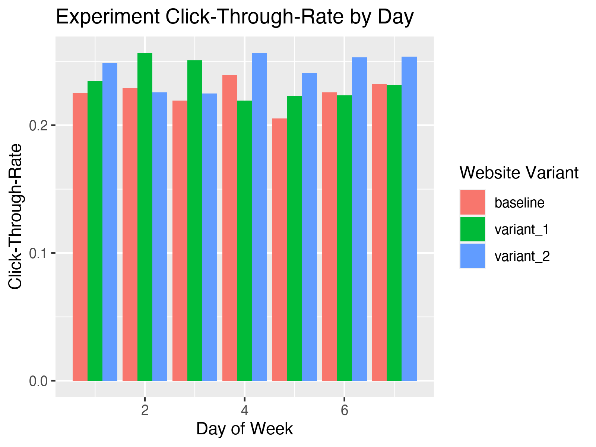
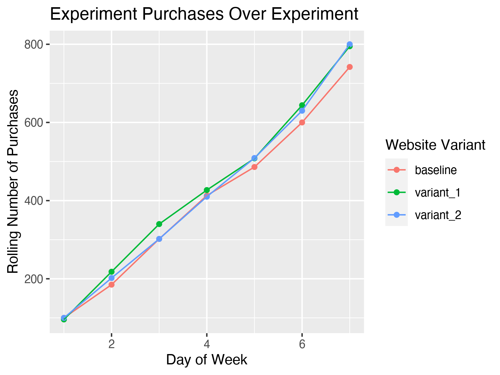
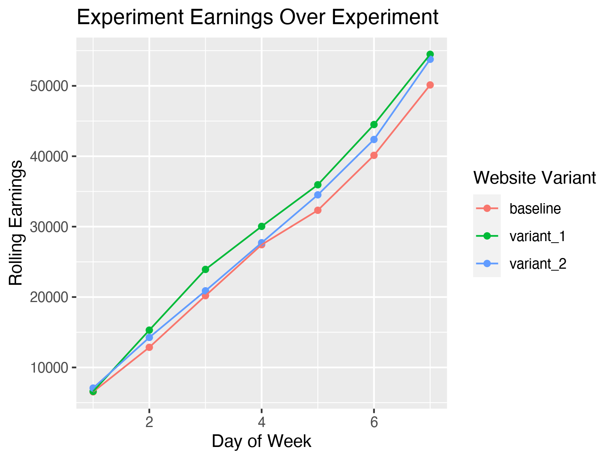
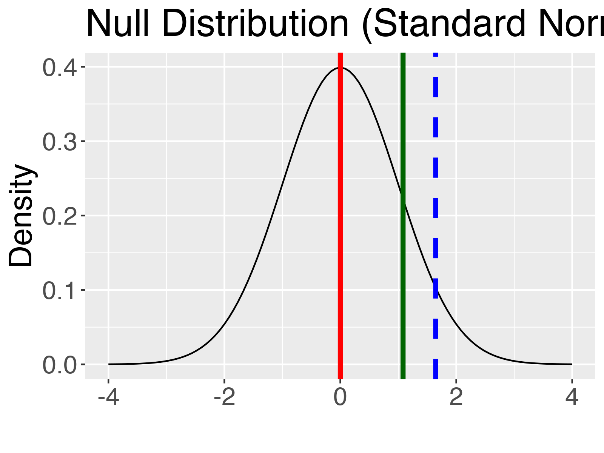
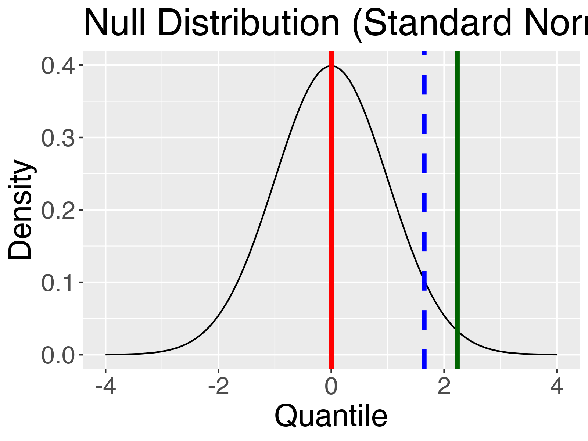
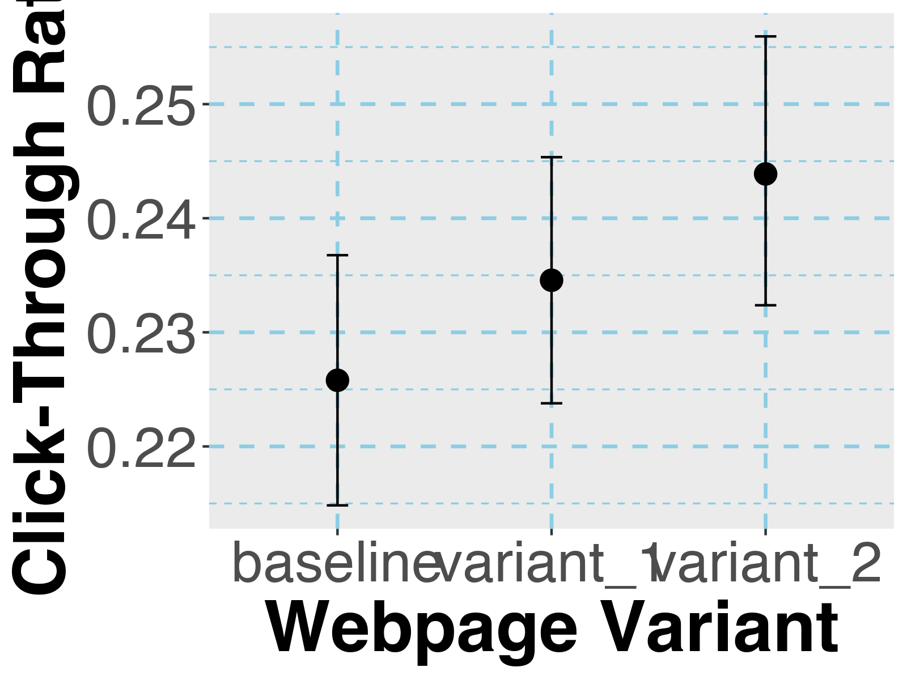

```{r echo=FALSE}
# Libraries
library(tidyverse)
library(knitr)
#library(kableExtra)
#library(gt)
#library(scales)
#library(sf)
library(cowplot)
library(magick)

# Set global chunk options
knitr::opts_chunk$set(echo=FALSE, message = FALSE, warning = FALSE, cache=TRUE)

```


# Overview

The product team for website rcds.com wants to create front page that will result in more people reaching the product service page. The motivation for this comes from user feedback sessions where 5/30 users expressed difficulty finding where to purchase rcds.com products. The design team have proposed moving the button from the hamburger menu to the center of the page and increasing the size.

## Design Variants

`Original`: Interaction of interest exists in hamburger menu.
`Variant 1`: Interaction of interest is moved to the center of the page.
`Variant 2`: Interaction of interest is moved to the center of the page and increased in size.

## Metrics of Interest

We need to measure the impact of the design change on users clicking the interaction to make it to the product sevice page, and also the impact on purchases/revenue.

1. `Primary Metric`: Click-Through-Rate (CTR) from landing page to service page
2. `Secondary Metric`: Purchases per user visit
3. `Secondary Metric`: Revenue per user visit
4. `Secondary Metric`: Total purchases
5. `Secondary Metric`: Total revenue

## Simulation

This is a fictitious example created to practice with R, and therefore I simulated
the datasets with the following parameters:

- \( p_{\text{baseline, ctr}} : 0.22 \)
- \( p_{\text{exp1, ctr}} : 0.23 \)
- \( p_{\text{exp2, ctr}} : 0.25 \) 

All simulated datasets had the same purchase rates for different products (the purchase page remains unchanged
in this experiment):

- \( p_{\text{\$0, purchase}} : 0.41 \)
- \( p_{\text{\$35, purchase}} : 0.3 \)
- \( p_{\text{\$75, purchase}} : 0.19 \)
- \( p_{\text{\$150, purchase}} : 0.1 \)

See the script `R/data_simulation.R` for recreation of datasets.

## Power Analysis

Now back to "reality".  Discussions between the product and data science team
has indicated that we would impliment changes if we see a 2% lift in click through
rate to the purchase page.

Because we believe our experimental pages will make it easier to progress on the
website, we will be doing a one-sided analysis.

Utilizing a tool from [UBC](https://www.stat.ubc.ca/~rollin/stats/ssize/b2.html) we can estimate how many visits
we need in our website variants and how long it will take.  We will use the following:

- \( \beta = 0.80 \)
- \( \alpha = 0.05 \)
- \( p_{\text{baseline, ctr}} : 0.22 \)
- \( p_{\text{change, ctr}} : 0.24 \)
- \( Test\ Type : One-Sided \)

This results in a needed `5,474` visits per website variant.  The website averages
`17,000` visits per week.  This means that the experiment will take an estimated
`7 days`.

\newpage

# QAQC

To ensure the experiment is not harmful we will monitor CTR, purchases per day,
and revenue per day.

Beginning with daily CTR, this seems relatively consistent daily and raised no
concerns.

```{r fig.height=6, fig.width=6, fig.hold=TRUE}

```

Next, we can see that the purchases of the website variants have higher total purchases
when looking at the rolling purchases over the course of the experiment.

```{r fig.height=6, fig.width=6, fig.hold=TRUE}

```

Next, we can see that the earnings of the website variants have higher total purchases
when looking at the rolling purchases over the course of the experiment.

```{r fig.height=6, fig.width=6, fig.hold=TRUE}

```

In summary, nothing gave us cause to worry so the experiment ran it's course.

\newpage

# Results

## Experiment 1: Fail to Reject

The experiment itself is a one-side proportion test (CTR).  

\( H_{0} : p_{\text{baseline}} = p_{\text{var1}} \) - There is no difference in the CTR between the baseline website and variant 1.

\( H_{A} : p_{\text{baseline}} \neq p_{\text{var1}} \) - The CTR of website variant 1 is greater than the baseline CTR.

```{r}
summary_df <- data.table::fread("../data/tables/experiment_summary.csv") %>% 
  filter(variant != "variant_2")

kable(summary_df, caption = "Variant 1 Summary")
```

```{r}
exp1_results <- readRDS("../data/tables/exp1_prop_test.rds")

print(paste0("P-Value: ", exp1_results$p.value))
```


```{r fig.height=6, fig.width=6, fig.hold=TRUE}

```

- Red: \( Z_{H_{0}} \) 
- Blue: \( Z^*_{H_{A}} \) 
- Green: \( \hat{Z} \) 

We can see that \( \hat{Z} \) for experiment 1 is less than \( Z^*_{H_{A}} \) AND
the p-value for this experiment is 0.138 which is less than our \( \alpha \).  Therefore,
we FAIL to reject the original website in favor of variant 1.

\newpage

## Experiment 2: Reject the NULL

The experiment itself is a one-side proportion test (CTR).  

\( H_{0} : p_{\text{baseline}} = p_{\text{var2}} \) - There is no difference in the CTR between the baseline website and variant 1.

\( H_{A} : p_{\text{baseline}} \neq p_{\text{var2}} \) - The CTR of website variant 1 is greater than the baseline CTR.

```{r}
summary_df <- data.table::fread("../data/tables/experiment_summary.csv") %>% 
  filter(variant != "variant_1")

kable(summary_df, caption = "Variant 2 Summary")
```

```{r}
exp2_results <- readRDS("../data/tables/exp2_prop_test.rds")

print(paste0("P-Value: ", exp2_results$p.value))
```


```{r fig.height=6, fig.width=6, fig.hold=TRUE}

```

- Red: \( Z_{H_{0}} \) 
- Blue: \( Z^*_{H_{A}} \) 
- Green: \( \hat{Z} \) 

We can see that \( \hat{Z} \) for experiment 2 is less than \( Z^*_{H_{A}} \) AND
the p-value for this experiment is 0.013 which is less than our \( \alpha \).  Therefore,
we REJECT the original website in favor of variant 2.

\newpage

## Confidence Intervals

```{r fig.height=8, fig.width=8, fig.hold=TRUE}

```


```{r}
```


```{r}
```


```{r}
```


```{r}
```


```{r}
```


```{r}
```


```{r}
```


```{r}
```


```{r}
```

